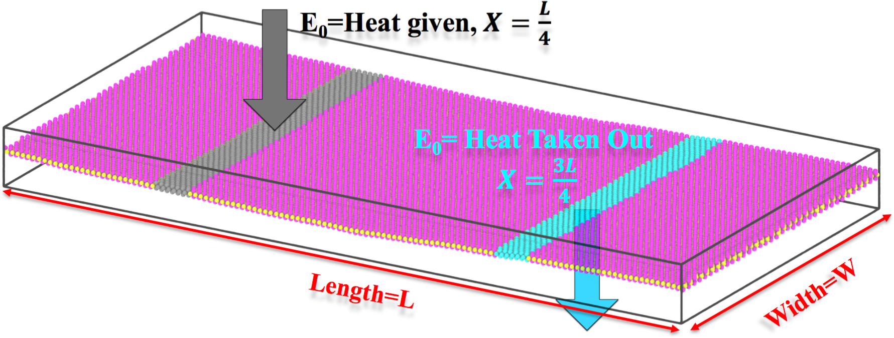

## Outline for the Manual
 
1. [**Background**](#1.-Background) : Introduction to thermal conductivity, \kappa of materials
2. [**NEMD simulations**](#2.-NEMD-Simulations) : Calculation of $\Large{\kappa}$ using molecular dynamics simulations
3. [**System size scaling**](#3.-System-size-scaling) : Effect of simulation cell size on calculated $\kappa$
4. [**Temperature scaling**](#4.-Temperature-scaling) : Effect of system temperature on calculated $\kappa$
5. [**Thermal conductivity plugins**](#5.-Thermal-conductivity-plugins) : Calculating $\kappa$ of MoS2
6. [**Quantum corrections**](#6.-Quantum-corrections) : Beyond classical thermal conductivity simulations
    * Velocity autocorrelation in equilibrium simulations
    * Phonon density of states
    * Specific heat of materials
    * Quantum-corrected thermal conductivity
7. [**Summary and take-away messages**](#7.-Summary-and-take-away-messages) : Things to remember when you do your own thermal conductivity simulations
8. [**Current research applications**](#8.-Current-research-applications) : Engineering thermal conductivity of materials. Brief look at thermal conductivity of fractal and alloyed systems
9. [**Downloads/Documentation**](#9.-Downloads-and-Documentation) : Thermal conductivity plugin downloads, Plugin manuals and contributing to software development
10. [**References**](#10.-References)

# 1. Background 

## Introduction to thermal conductivity

* Thermal conductivity (denoted by the symbol $\kappa$) is a fundamental property of materials that determines their ability to conduct (i.e. transmit) heat (See Refs 1,2). Materials with a higher $\kappa$ values conduct heat well and low-$\kappa$ materials are more insulating (Ref 9.).

<h4>Table 1: Thermal conductivity of common materials</h4>

| Material       | $\huge{\kappa}$ (W/m-K) |
|----------------|:-------------------------------------:|
| Diamond        | 1000                                  |
| Silver         | 406                                   |
| Copper         | 401                                   |
| Water          | 0.591                                 |
| Wood           | 0.12                                  |
| Wool           | 0.0464                                |
| Air            | 0.025                                 |
| Silica Aerogel | 0.003                                 |

* High-$\kappa$ materials are commonly used in heat-sink and thermal-dissipation applications and materials with low thermal conductivity are used primarily for insulation. Low $\kappa$ insulating materials are also used for thermoelectric energy harvesting applications (See [Section 8](#8.-Current-research-applications)).

* Both high and low $\kappa$ materials are extremely useful for engineers. Below, we see two demonstrations of the extremely-low $\kappa$ materials used as thermal insulators on the Space Shuttle during re-entry (Refs. 10,11).

# 2. NEMD Simulations

### Theory and Equations

As described previously, thermal conductivity is calculated by measuring the temperature gradient along the material. We establish the thermal gradient by adding and removing a predefined quantity of heat, $E_0$, at $x = \frac{L}{4}$ and $x = \frac{3L}{4}$ respectively. Since we can control the amount, $E_0$ and frequency of heat input, $\frac{1}{\Delta t}$ , we effectively control the heat flux in the system. Once the steady-state temperature profile is established in the simulation cell, we combine the temperature profile with the known heatflux to calculate the thermal conductivity.

Specifically,

Heat Flux, **$\displaystyle J_y = \frac{1}{2} \frac{E_0}{\Delta t}$**

The factor $\displaystyle \frac{1}{2}$ comes from the fact that heat conduction happens along both the $+x$ and $-x$ directions away from the heat source at $x = \frac{L}{4}$.

Also, from Fourier's law of thermal conduction, we have $\displaystyle J_y = - \kappa \cdot A \cdot \frac{\mathrm{d}T}{\mathrm{d}x}$, where $A$ is the cross sectional area of heat transfer. (Ref 6)

Putting these equations together, we have $\displaystyle \kappa = - \frac{1}{2\ A} \frac{E_0}{\Delta t} \frac{\mathrm{d}x}{\mathrm{d}T}$

Note here that the thermal conductivity $\kappa$ goes as the _inverse_ of the temperature gradient. More conducting material will have 'flatter' temperature profiles.

<h4>Image 3: Schematic of NEMD simulations for measuring thermal conductivity of 2D materials</h4>

