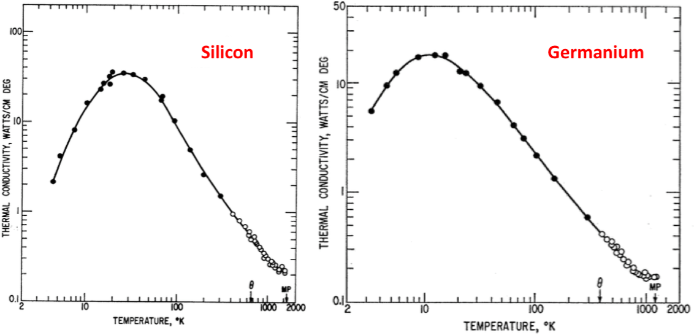
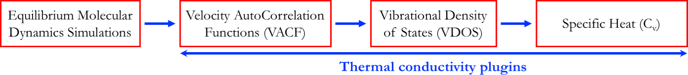

## Outline for the Manual
 
1. [**Background**](#1.-Background) : Introduction to thermal conductivity,  of materials
2. [**NEMD simulations**](#2.-NEMD-Simulations) : Calculation of  using molecular dynamics simulations
3. [**System size scaling**](#3.-System-size-scaling) : Effect of simulation cell size on calculated 
4. [**Temperature scaling**](#4.-Temperature-scaling) : Effect of system temperature on calculated 
5. [**Thermal conductivity plugins**](#5.-Thermal-conductivity-plugins) : Calculating  of MoS2
6. [**Quantum corrections**](#6.-Quantum-corrections) : Beyond classical thermal conductivity simulations
    * Velocity autocorrelation in equilibrium simulations
    * Phonon density of states
    * Specific heat of materials
    * Quantum-corrected thermal conductivity
7. [**Summary and take-away messages**](#7.-Summary-and-take-away-messages) : Things to remember when you do your own thermal conductivity simulations
8. [**Current research applications**](#8.-Current-research-applications) : Engineering thermal conductivity of materials. Brief look at thermal conductivity of fractal and alloyed systems
9. [**Downloads/Documentation**](#9.-Downloads-and-Documentation) : Thermal conductivity plugin downloads, Plugin manuals and contributing to software development
10. [**References**](#10.-References)

# 1. Background 

## Introduction to thermal conductivity

* Thermal conductivity (denoted by the symbol ) is a fundamental property of materials that determines their ability to conduct (i.e. transmit) heat (See Refs 1,2). Materials with a higher  values conduct heat well and low- materials are more insulating (Ref 9.).

<h4>Table 1: Thermal conductivity of common materials</h4>

| Material       | <a href="https://www.codecogs.com/eqnedit.php?latex=\large&space;\kappa" target="_blank"> (W/m-K) |
|----------------|:-------------------------------------:|
| Diamond        | 1000                                  |
| Silver         | 406                                   |
| Copper         | 401                                   |
| Water          | 0.591                                 |
| Wood           | 0.12                                  |
| Wool           | 0.0464                                |
| Air            | 0.025                                 |
| Silica Aerogel | 0.003                                 |

* High- materials are commonly used in heat-sink and thermal-dissipation applications and materials with low thermal conductivity are used primarily for insulation. Low  insulating materials are also used for thermoelectric energy harvesting applications (See [Section 8](#8.-Current-research-applications)).

* Both high and low  materials are extremely useful for engineers. 
# 2. NEMD Simulations

### Theory and Equations

As described previously, thermal conductivity is calculated by measuring the temperature gradient along the material. We establish the thermal gradient by adding and removing a predefined quantity of heat, E0, at  and  respectively. Since we can control the amount, E0 and frequency of heat input,  , we effectively control the heat flux in the system. Once the steady-state temperature profile is established in the simulation cell, we combine the temperature profile with the known heatflux to calculate the thermal conductivity.

Specifically,

Heat Flux, 

The factor  comes from the fact that heat conduction happens along both the +x and -x directions away from the heat source at .

Also, from Fourier's law of thermal conduction, we have , where A is the cross sectional area of heat transfer. (Ref 6)

Putting these equations together, we have 

Note here that the thermal conductivity   goes as the _inverse_ of the temperature gradient. More conducting material will have 'flatter' temperature profiles.

<h4>Image 1: Schematic of NEMD simulations for measuring thermal conductivity of 2D materials</h4>

# 3. System size scaling

## Thermal conductivity is affected by size of the system in NEMD simulations
Length Scaling is a direct consequence because of MD. The thermal transport in NEMD happens over two square regions. Phonons having mean free path largest than the size of the square do not take part in thermal transport in our system setup. As the system increases in size, more and more phonons are being involved in thermal transport. Studies have shown the mean free path for Transition metal Dichalcogenides is of the order of 1000 nm \cite{gandi2016thermal}. It is therefore essential to scale systems to at least one third its value.

These simulations are performed inside the Casimir Limit. This results in thermal conductivity values having a strong size dependence. Following the scaling scheme of Schon which uses Matthiessen's Rule . To predict the thermal conductivity of the infinite system we make use of a linear function such as

Here,  is the inverse scattering length relating to the heat source-sink distance and  is the material's inverse scattering length because of phonon phonon scattering. 

It is important to note that length scaling happens in two dimensions. It is important to maintain a 2:1 ratio between length and width while increasing system size. The major difference is that one dimensional scaling ignores the contribution of phonons with wavelengths larger than the smallest dimension of the solid, whereas two dimensional scaling is inclusive.

# 4. Temperature scaling

## Thermal conductivity is affected by the temperature of the system

The system temperature reflects the population of phonons in the material. At higher temperatures, there is a greater chance of phonon scattering (by other phonons) leading to reduced thermal conductivity.

# 6. Quantum corrections

## Going beyond classical thermal conductivity simulations

<h4>Image 4: Experimentally-measured thermal conductivity of two bulk semiconductors, Silicon and Germanium. Taken from Glassbrenner, C. J. and G. A. Slack, Phys. Rev. 134, 4A (1964) A1058-A1069</h4>

The main discrepancy arises because classical molecular dynamics simulations (like ours) do not correctly describe the specific heat of materials (denoted by CV) at low temperatures. There is a method to correct for this deficiency by calculating the quantum-mechanically accurate specific heat of materials separately using equilibrium molecular dynamics simulations. This involves computing the velocity autocorrelation functions, the vibrational density of states and the specific heat, in that order, from the MD simulations, as shown below.

<h4>Image 5: Workflow for calculating specific heat from equilibrium MD simulations</h4>

### Velocity AutoCorrelation Functions (VACF) and Vibrational Density Of States (VDOS)

The velocity autocorrelation function Z(t) for atom type  is defined as 

The density of states is given by the equation
 

 
Here Z is the velocity autocorrelation for each element. G() is the density of states. If you observe the following equation you can see that the vibrational density of state is simply proportional to the Fourier transform of the velocity autocorrelation. 
 

With the density of states available, we can calculate specific heat using the following equation. This simply multiplies the vibrational energy of each state with the temperature derivative of the probability of occupation of each vibrational state.

where 

### Major steps involved in VACF  VDOS   Cv calculations
 
1. **Create a relaxed system at any given temperature**  : We use a LAMMPS Script to create a dump file.
2. **Compute the VACF, VDOS and Cv from the LAMMPS dump file** : Use the file `caldos.py` which does the calculation for you

The directory also has a file `caldos.py`. This is a python script that calls a C program `dos.c` that performs the VDOS calculations for us and plots the output. We won't actually be modifying that file in today's session. `dos.c` requires an input file `input.txt` that contains values for the various parameters required for the calculation. Let us take a look at that file.

It is essential to understand the variables in this file. We will talk about a few important ones.

1. `dT` refers to the time-step of the equilibrium MD simulations. In our case, it is 1 fs or 0.001 ps
2. `TFREQ` refers to frequency with which snapshots are written out by LAMMPS. In our case, we write a snapshot every 10 timesteps
3. `massMo` and `massS` are the atomic masses of Molybdenum (95.94) and Sulfur (32.065) respectively
4. `Corrlength` is the length of the trajectory over which VACF is calculated
5. `Ninitial` is the number of initial conditions for calculating VACF and `Ngap` is the time-delay between consecutive initial conditions. These two sampling parameters are described in detail below.

### Important points about Ninitial, Ngap and Corrlength

One of the most significant improvements enabled by the thermal conductivity plugin tools is the usage of multiple initial conditions for calculation of velocity autocorrelation functions. This relies on the fact that the crystal at equilibrium 'loses memory' of its velocities after a few ps. Therefore, a single long MD trajectory can be broken into multiple overlapping independent sub-trajectories, each `Corrlength` steps long and separated from each successive sub-trajectory by `Ngap` steps. This significantly improves the sample-size for the calculation of atomic velocity correlations, often by over 1 order of magnitude.

* NFrame is the total number of frames, which is equal to the number of steps that we run the simulation for.
* We must ensure that 

* If this condition isn't satisfied we will get an error, because the program does not get enough data
